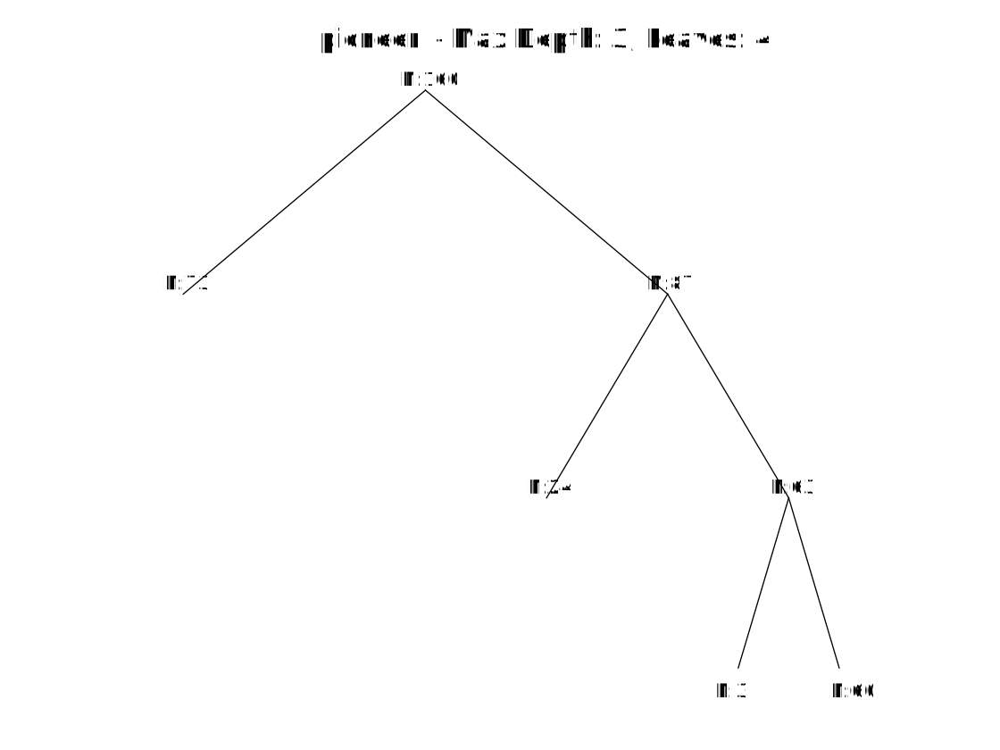

# SigISC

### Implementation Highlight

The significance-based clustering tree from the paper "**Significance-based Interpretable Sequence Clustering**" has been implemented in Matlab (`SigISC.m`), providing **faster** execution with the same results as the prior Python version (`SigISC.py`) in the co-author's [repository](https://github.com/JinfengHe/SigISC).

### View Our Method's Results

To view the final performance results as presented in the paper, simply run `main.m` in Matlab.

  

### Datasets Used

The folder `Sequence2BinaryData` contains 14 real-world sequential datasets that have been profiled by specific patterns. These patterns have been mined using the "**Sequential Pattern Discovery under Multiple Constraints**" method ([PatternMining.py](https://github.com/JinfengHe/SigISC/blob/master/PatternMining.py)).

---

# Comparison Methods

This folder `Comparison` contains scripts for comparing various interpretable clustering methods, including IMM, SHA, and CUBT. The input data for these methods is the same as the one used for constructing the decision tree with SigISC, as provided in the `Sequence2BinaryData` folder. For the ISCT method, please refer to the official PyPI [page](https://pypi.org/project/ISCT/).

### How to Run the Comparison Methods

1. **Prepare the Input Data**: 
   - Copy the `Sequence2BinaryData` folder into the `Comparison` directory.

2. **Running CUBT Methods**: 
   - Use the script `seq_main_CUBT_two.R`.
   - If the required libraries are not installed, you may need to install the corresponding R packages.

3. **Running IMM and SHA Methods**: 
   - Use the script `seq_main_IMM_SHA.py`. 
   - To avoid the hassle of package installation and compilation, I have provided a virtual environment (PyCharm venv).
   - Download the compressed file `venv.7z` from [here](https://github.com/hulianyu/SigTree/tree/main/ComparedMethods).
   - Extract the file and import the environment as your Python interpreter (on Windows) to run the script.

---
